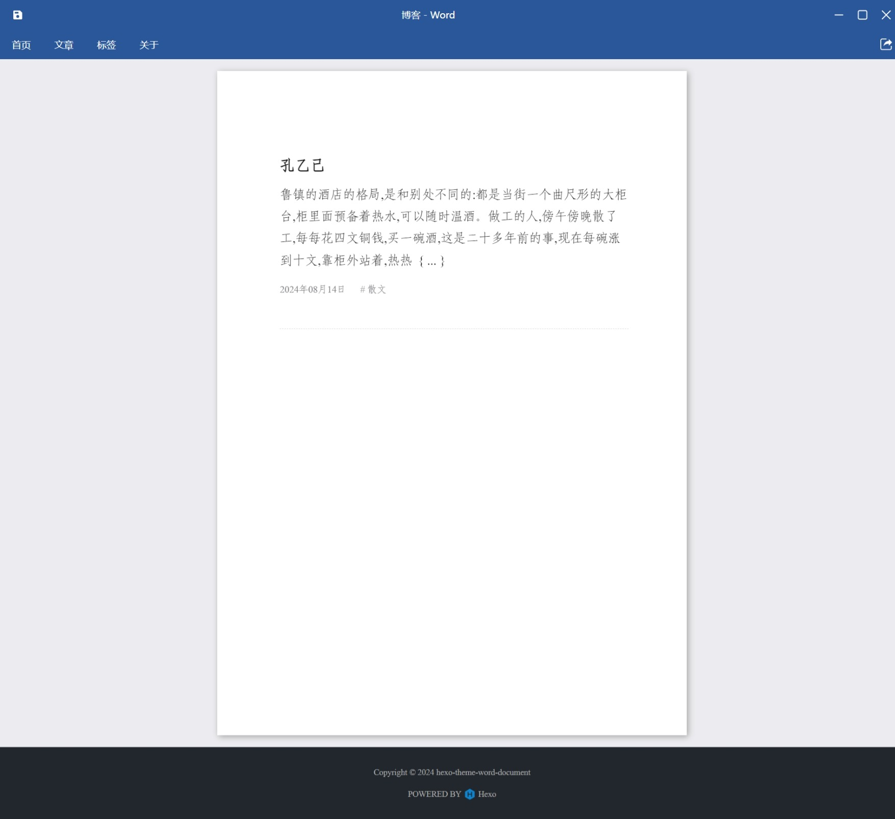
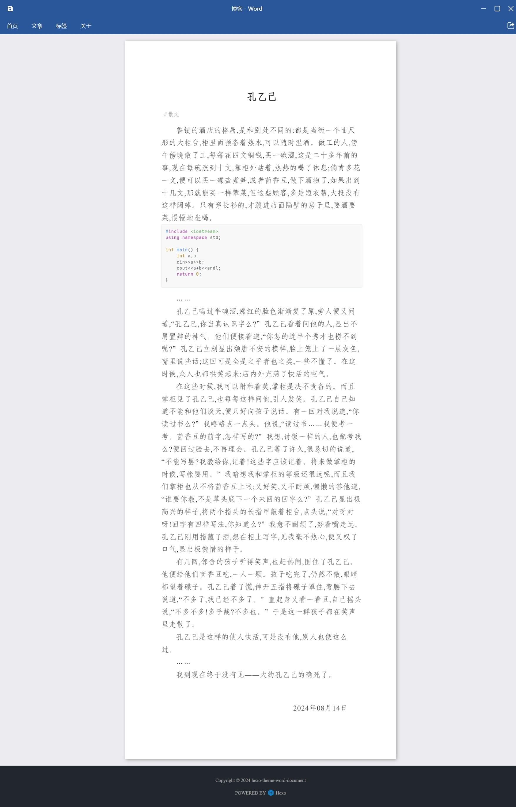
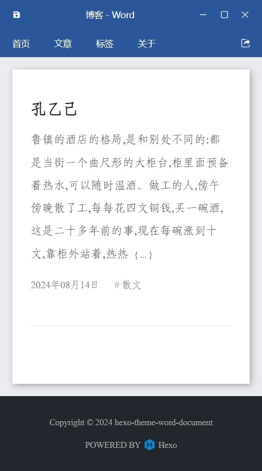

  

<h1 align="center">hexo-theme-word-document</h1>

Hexo Theme Inspired by Word Document Style

<a href="README.md">简体中文</a> ｜ English

## Notice: This is a work in progress. Not all features are implemented, testing is incomplete, and it has not been uploaded to the npm repository.

## Overview
Hexo Theme Inspired by Word Document Style  
CSS styling based on national standard document formatting for government and party organizations:
+ Page: Width set to standard A4 paper width (210mm), height not specified.
+ Fonts: Chinese text uses FangSong GB2312, Western text uses Times New Roman.
+ Font size is set to 16pt (corresponding to "size 3" in Chinese typography).
+ Line spacing is 28 points (line-height set to 9.7mm).
+ First line indentation is two characters (text-indent set to 2em).
+ Page margins: Top margin 37mm, bottom margin 35mm, left margin 28mm, right margin 26mm.

## Demo
#### Homepage

#### Article Page

#### Mobile View
