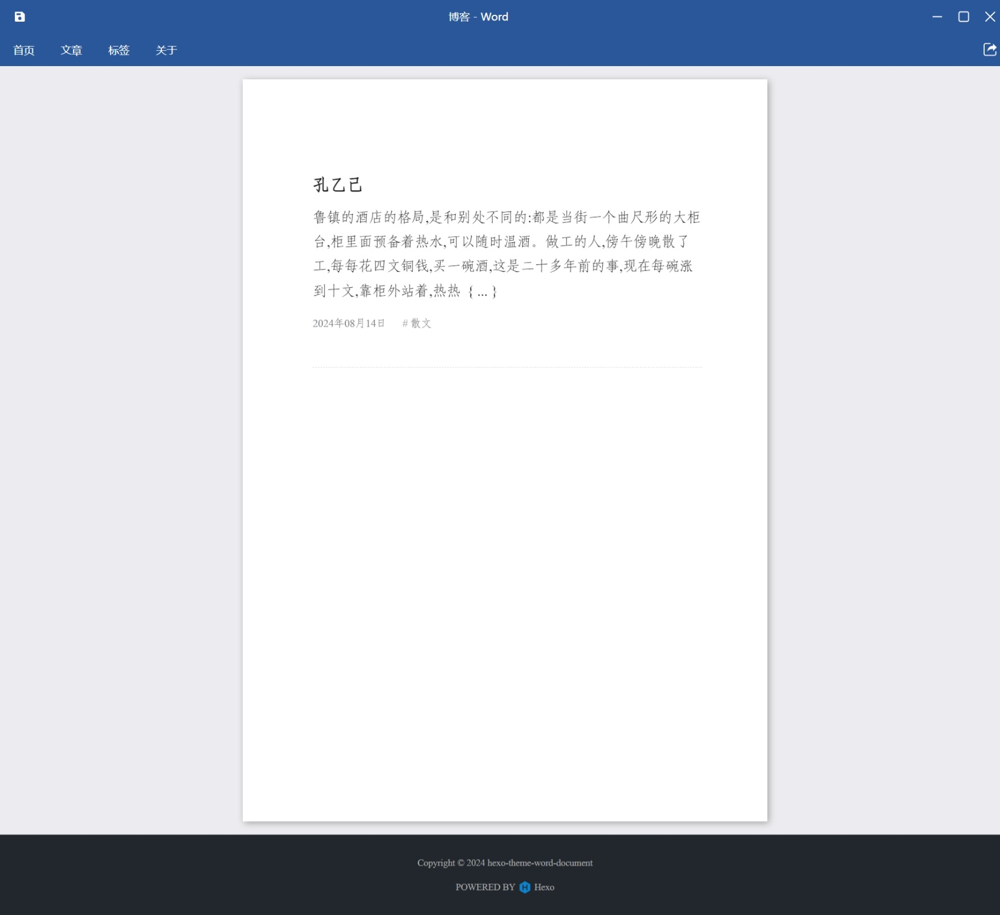
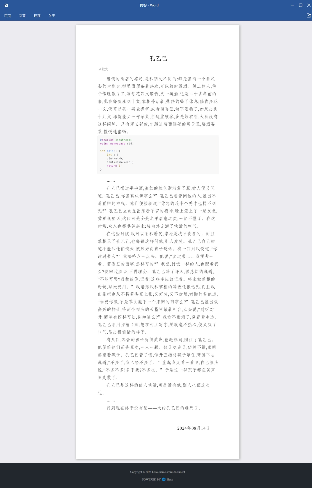

  

<h1 align="center">hexo-theme-word-document</h1>

Word文档风格的Hexo主题

简体中文 ｜ <a href="README.en.md">English</a>

## 注意：当前为半成品，尚未实现全部功能、尚未进行测试、尚未上传至npm仓库

## 概述
Word文档风格的Hexo主题  
CSS样式参考了党政机关国家标准公文格式
+ 页面：宽度为标准A4纸宽度（210mm），高度不设置
+ 字体：中文字体使用仿宋GB2312，西文字体使用Times New Roman
+ 字体大小为三号（`font-size`设置为16pt）
+ 行间距为28磅（`line-height`设置为9.7mm）
+ 页边距：上边距37mm，下边距35mm，左边距28mm，右边距26mm

## 演示
#### 首页

#### 文章页

#### 手机端
